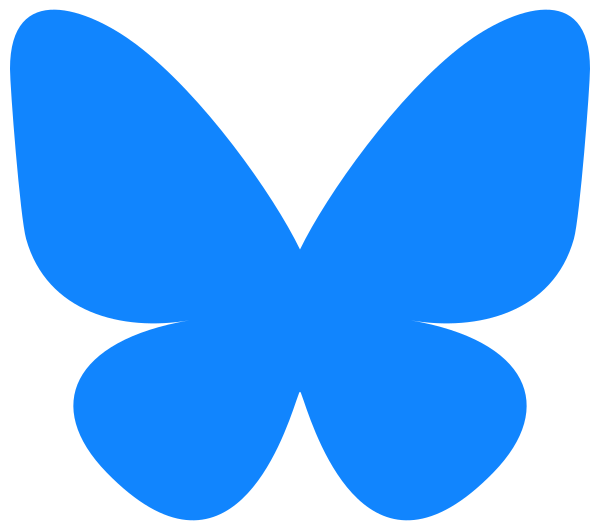

<h1 align="left">Hæ hæ! 👋</h1>

###

<h3 align="left">About me:</h3>

- ⚒️ I'm currently working two jobs, sales rep for a small shop in Iceland and Software Engineer for CPS-Acuo.
- 🎓 BCs in computer science from Reykjavík University.
- 💬 Ask me about Cooking, Gaming or Dungeons and Dragons!

📫 Don't know how to reach me? Try these:

###

  
  
  

###

 

<h2 align="left">📈 GitHub Stats</h2>

###

 

  
  

  
  

###

 

